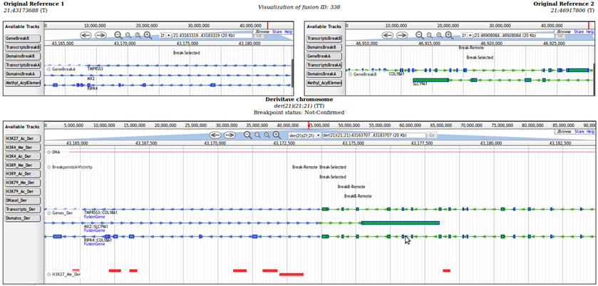

fusionAnnotator
===============

##Description

FusionAnnotator is a tool that visualizes, annotates and ranks double-stranded DNA breaks (DSB) through a pre-selection of user-specified importance. It accepts confirmed and non-confirmed (exact break site is not known) breakpoints originating from multiple species and searches for in- and out-frame fusionpoint overlapping de novo fusiongenes, intronic and exonic gene breaks, promoter breaks and user-specified genes, domains and regulatory elements using the data available in the Ensembl databases. 

These DSBs can then be visualized to give an overview of the derivative genome in regards to the reference genome. The orientations of the breakpoints are taken into account whilst annotating and visualizing the breakpoints. 

Additional .GFF, .BED, .WIG and .BAM/BAI support files can also be coupled to individual fusionpoints or entire samples and are visualized alongside the derivative situation.

This tool was used to visualize chromothripsis (massive DNA rearrangements affecting one or a few chromosomes due to a single large DNA shattering/repair event) in patients.

**Unfortunately, large parts of this tool have not been made public and it is not able to run independently without these modules**

##Installation/setup
- Install the Ensembl perl modules on the server where the scripts will be run	
- Download and setup [JBrowse](http://jbrowse.org/)

##Impression Interface

